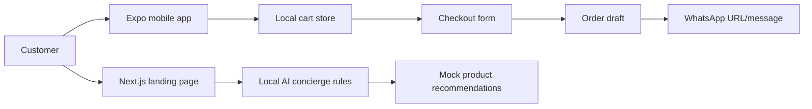

# SALORA Phase 1.5 Architecture Review

## Current Folder Structure

```txt
salora-platform/
├── apps/
│   ├── web/       # Next.js App Router landing experience
│   ├── mobile/    # Expo Router mobile ordering shell
│   └── admin/     # Phase 2 dashboard placeholder
├── packages/
│   ├── config/    # shared brand constants
│   ├── data/      # local products, concierge rules, WhatsApp generator
│   ├── types/     # product, cart, order, concierge contracts
│   └── ui/        # shared design tokens and UI class foundations
└── docs/          # product, QA, deployment, and roadmap documentation
```

## Strengths

- Clear monorepo boundaries with separate web, mobile, admin, data, types, config, and UI layers.
- Phase 1 scope is disciplined: local data and local AI logic only, no fake backend claims.
- Shared product and order contracts reduce drift between web, mobile, and future Supabase integration.
- WhatsApp message generation is isolated in `packages/data`, making future integration straightforward.
- Next.js and Expo are independently runnable deployable units.

## Weaknesses

- Mobile and web still duplicate some visual composition patterns because cross-platform UI primitives are intentionally light.
- Admin is documented but not implemented, so operational workflows remain conceptual.
- No automated test suite yet for cart, checkout, concierge, or WhatsApp formatting.
- Local images are copied into app folders rather than managed through a single asset pipeline.
- Expo startup can be sensitive to local `.expo` permissions unless telemetry is disabled in restricted environments.

## Technical Debt

- The landing page is still a single route-level composition; future content management will require section extraction.
- Product visuals are stylized placeholders, not final menu photography.
- Mobile form validation is basic and should move to a validation schema in Phase 2.
- No error boundary screens for web/mobile exceptional states beyond defensive empty UI.

## Service Boundaries

| Boundary | Current Owner | Responsibility | Phase 2 Evolution |
|---|---|---|---|
| Web experience | `apps/web` | Brand, investor story, public CTA | Vercel deployment, CMS blocks, SEO |
| Mobile ordering | `apps/mobile` | Menu browsing, cart, checkout, loyalty preview | EAS builds, auth, live orders |
| Product data | `packages/data` | Local mock source of truth | Supabase fetchers and mutations |
| Domain contracts | `packages/types` | Product, cart, order, concierge types | Generated or shared DB-aligned types |
| Design system | `packages/ui` | Tokens and shared UI constants | Component library and native mappings |
| Admin | `apps/admin` | Documented future control plane | Protected operational dashboard |

## API Contracts

Current contracts are local TypeScript functions, not network APIs:

- `getProductById(id): Product | undefined`
- `recommendFromPrompt(prompt): ConciergeReply`
- `createOrderDraft(customer, items): OrderDraft`
- `generateWhatsAppMessage(order): string`
- `generateWhatsAppUrl(order, number?): string`

Future API contracts should preserve these shapes while replacing local arrays with Supabase-backed read/write functions.

## Event Flows



## Deployment Strategy

- Web: deploy `apps/web` to Vercel with monorepo root and `pnpm --filter @salora/web build`.
- Mobile: run locally with Expo, then configure EAS project, app icon, splash, bundle IDs, and store metadata.
- Admin: keep as placeholder until Supabase Auth, RLS, and operational requirements are defined.

## Observability Strategy

Phase 1.5 does not add analytics or external monitoring. Recommended Phase 2 signals:

- Web: page load, CTA clicks, concierge prompt categories, build health.
- Mobile: screen flow, cart conversion, checkout validation failures, order confirmation.
- Backend: order creation latency, WhatsApp delivery status, Supabase errors, admin mutation audit logs.

## Risk Assessment

- Low risk: static web, local data, mock AI, WhatsApp URL generation.
- Medium risk: mobile runtime variance across Expo/React Native versions and local permissions.
- Medium risk: product data duplication if Supabase migration is not handled through `packages/data`.
- High future risk: introducing payments, order management, or admin writes without RLS and audit logging.

## Scalability Assessment

The current architecture is suitable for demo, investor review, and early product validation. It can scale cleanly into Phase 2 if live data remains behind shared packages and admin writes are added with explicit security boundaries.
