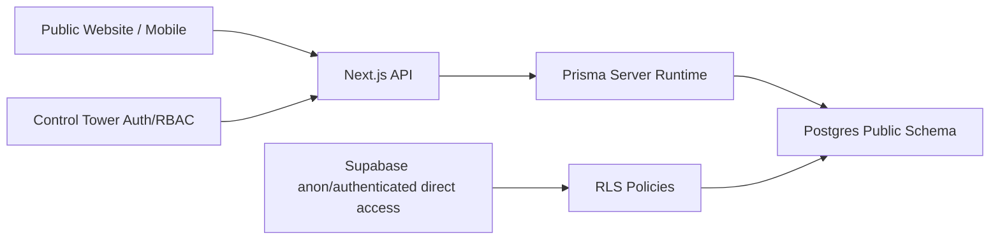

# SALORA Database Access Matrix

Date: 2026-06-08

Classification legend:

- `PUBLIC_READ`: anonymous read may be allowed for safe published content only.
- `AUTHENTICATED_READ`: signed-in customer/staff read only.
- `OWNER_ONLY`: customer can access only rows tied to their identity.
- `STAFF_ONLY`: operational staff and above.
- `MANAGER_ONLY`: manager and admin.
- `ADMIN_ONLY`: admin only.
- `SERVICE_ROLE_ONLY`: server/runtime/service role only.

## Matrix

| Table | Access Classification |
| --- | --- |
| `users` | ADMIN_ONLY; OWNER_ONLY limited self-read; SERVICE_ROLE_ONLY write |
| `roles` | AUTHENTICATED_READ; ADMIN_ONLY write |
| `user_roles` | ADMIN_ONLY |
| `sessions` | OWNER_ONLY; SERVICE_ROLE_ONLY write |
| `customer_profiles` | OWNER_ONLY; STAFF_ONLY read; MANAGER_ONLY write |
| `customer_addresses` | OWNER_ONLY; STAFF_ONLY read for active order support |
| `customer_preferences` | OWNER_ONLY |
| `product_categories` | PUBLIC_READ; MANAGER_ONLY write |
| `catalog_products` | PUBLIC_READ active-only; MANAGER_ONLY write |
| `product_images` | PUBLIC_READ non-deleted active product images; MANAGER_ONLY write |
| `product_media_drafts` | STAFF_ONLY read; MANAGER_ONLY write/approve; SERVICE_ROLE_ONLY publish automation |
| `product_variants` | PUBLIC_READ through active products; MANAGER_ONLY write |
| `product_addons` | PUBLIC_READ through active products; MANAGER_ONLY write |
| `product_modifiers` | PUBLIC_READ through active products; MANAGER_ONLY write |
| `pricing_rules` | STAFF_ONLY read; MANAGER_ONLY write |
| `coupons` | PUBLIC_READ active public coupon metadata only; MANAGER_ONLY write |
| `coupon_redemptions` | OWNER_ONLY read; SERVICE_ROLE_ONLY write; MANAGER_ONLY read |
| `promotions` | PUBLIC_READ active approved only; MANAGER_ONLY write |
| `promotion_products` | PUBLIC_READ active approved only; MANAGER_ONLY write |
| `availability_rules` | PUBLIC_READ through active products; MANAGER_ONLY write |
| `customer_favorites` | OWNER_ONLY |
| `saved_orders` | OWNER_ONLY |
| `cafe_orders` | OWNER_ONLY; STAFF_ONLY read/update; SERVICE_ROLE_ONLY create |
| `order_items` | OWNER_ONLY through order; STAFF_ONLY |
| `order_timeline` | OWNER_ONLY through order; STAFF_ONLY write |
| `order_notes` | OWNER_ONLY non-staff notes; STAFF_ONLY all notes |
| `payments` | OWNER_ONLY limited read; STAFF_ONLY read; SERVICE_ROLE_ONLY write |
| `payment_intents` | SERVICE_ROLE_ONLY |
| `refunds` | STAFF_ONLY read; MANAGER_ONLY write |
| `payment_events` | SERVICE_ROLE_ONLY |
| `payment_method_references` | SERVICE_ROLE_ONLY |
| `payment_audit_logs` | ADMIN_ONLY; SERVICE_ROLE_ONLY write |
| `payment_reconciliation_records` | MANAGER_ONLY |
| `product_reviews` | PUBLIC_READ approved only; OWNER_ONLY write; STAFF_ONLY moderation |
| `conversations` | OWNER_ONLY; STAFF_ONLY support read |
| `conversation_messages` | OWNER_ONLY through conversation; STAFF_ONLY support read; SERVICE_ROLE_ONLY write |
| `channel_sessions` | SERVICE_ROLE_ONLY |
| `provider_messages` | SERVICE_ROLE_ONLY |
| `whatsapp_webhook_events` | SERVICE_ROLE_ONLY |
| `ai_evaluation_records` | MANAGER_ONLY |
| `ai_recommendation_records` | OWNER_ONLY; MANAGER_ONLY analytics |
| `suppliers` | MANAGER_ONLY |
| `ingredients` | STAFF_ONLY read; MANAGER_ONLY write |
| `stock_movements` | STAFF_ONLY read; MANAGER_ONLY write |
| `consumption_records` | STAFF_ONLY |
| `loyalty_accounts` | OWNER_ONLY; STAFF_ONLY read |
| `loyalty_ledger_entries` | OWNER_ONLY; STAFF_ONLY read; SERVICE_ROLE_ONLY write |
| `rewards` | PUBLIC_READ active rewards; MANAGER_ONLY write |
| `reward_redemptions` | OWNER_ONLY; STAFF_ONLY read; SERVICE_ROLE_ONLY write |
| `notification_templates` | MANAGER_ONLY |
| `notifications` | OWNER_ONLY; SERVICE_ROLE_ONLY write |
| `notification_delivery_logs` | SERVICE_ROLE_ONLY |
| `feature_flags` | ADMIN_ONLY; SERVICE_ROLE_ONLY read |
| `activity_logs` | MANAGER_ONLY read; SERVICE_ROLE_ONLY write |
| `audit_logs` | ADMIN_ONLY read; SERVICE_ROLE_ONLY write |
| `runtime_configurations` | ADMIN_ONLY; SERVICE_ROLE_ONLY read |

## API Contracts Affected

| API Surface | Expected Access After RLS |
| --- | --- |
| `/api/products` | Public read from server Prisma remains available; direct DB public reads limited to active catalog content. |
| Control Tower APIs | Server Prisma remains authority; human role checks remain in app layer. |
| Auth routes | Server Prisma can manage users/sessions; direct public access blocked. |
| WhatsApp webhooks | Service/server-only insert/update of webhook events. |
| OpenAI workflows | Server-only writes to AI records and media drafts. |

## Event Flow Sensitivity

