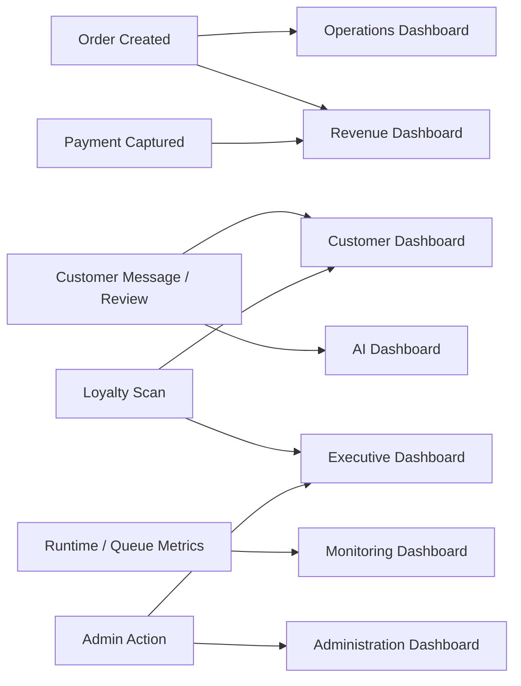

# SALORA Command Center Mapping

## Exact Screen Mapping

| SALORA target screen | DEV source screen(s) | Source files | Reuse mode | Notes |
|---|---|---|---|---|
| Executive Dashboard | Command Deck, selected Analytics quick metrics, audit ledger | `src/components/CommandDeck.tsx`, `src/components/AnalyticsPanel.tsx` | Extract and refactor | Fastest high-value path. Replace fixtures with executive summary APIs. |
| Revenue Dashboard | Command Deck financial chart, Analytics product popularity, Enterprise Architect pricing module, AI Content campaign outputs | `CommandDeck.tsx`, `AnalyticsPanel.tsx`, `EnterpriseArchitect.tsx`, `AIContentStudio.tsx` | Extract widgets | Needs `/api/payments/*`, campaign attribution, product mix data. |
| Operations Dashboard | Barista order stream, Automation Engine, Database Studio product/inventory table, diagnostics queue routes | `CommandDeck.tsx`, `AutomationEngine.tsx`, `DatabaseStudio.tsx`, `src/api/diagnostics.routes.ts` | Extract and rewrite data adapters | Needs live orders, queue, inventory, audit APIs. |
| AI Dashboard | AI Brain, AI Content Studio, AI Visual Hub, AI Tuner, prompt table | `AIBrain.tsx`, `AIContentStudio.tsx`, `AIVisualHub.tsx`, `AiTuner.tsx`, `DatabaseStudio.tsx` | Extract UI, replace `/api/gemini/*` | Use `/api/ai/*` provider gateway. |
| Customer Dashboard | Headless CMS customer app preview, loyalty widget, wallet pass, review reply module, team/customer touchpoints | `HeadlessCms.tsx`, `AppleIosHub.tsx`, `EnterpriseArchitect.tsx` | Split and refactor | Needs `/api/customers/*` and `/api/loyalty/*`. |
| WhatsApp Dashboard | Enterprise Architect WhatsApp simulator, AI content WhatsApp syndication action, Automation endpoint node | `EnterpriseArchitect.tsx`, `AIContentStudio.tsx`, `AutomationEngine.tsx` | Rewrite as real integration dashboard | Needs message threads, bot intent detection, send status, opt-in tracking. |
| Mobile Executive Dashboard | Headless CMS phone simulator, lock screen live activity, Expo mobile screens | `HeadlessCms.tsx`, `mobile/app/**`, `mobile/components/**` | Reuse simulator + mobile primitives | Treat simulator as executive preview; keep mobile app separate. |
| Monitoring Dashboard | Analytics Panel, Enterprise Architect health/tests, Bull Board, Grafana queue overview | `AnalyticsPanel.tsx`, `EnterpriseArchitect.tsx`, `src/api/admin.routes.ts`, `grafana/dashboards/queue-overview.json` | Extract and bind to operational APIs | Strong backend foundation already present. |
| Administration Dashboard | Database Studio, Team Roster, Enterprise Architect RBAC/JWT/security modules | `DatabaseStudio.tsx`, `TeamRoster.tsx`, `EnterpriseArchitect.tsx` | Refactor | Needs real RBAC, permissions, audit trail, persistence. |

## Recommended Navigation for SALORA Executive Command Center

1. Executive
2. Revenue
3. Operations
4. AI Studio
5. Customers
6. WhatsApp
7. Mobile Preview
8. Monitoring
9. Administration

## Bounded Context Mapping

| Bounded context | Screens | Data owner |
|---|---|---|
| Executive Intelligence | Executive Dashboard, AI Dashboard | `/api/intelligence/*`, `/api/ai/*` |
| Commerce and Revenue | Revenue Dashboard | `/api/payments/*`, `/api/orders/*` |
| Cafe Operations | Operations Dashboard, Monitoring Dashboard | `/api/operations/*`, `/api/orders/*` |
| Customer and Loyalty | Customer Dashboard, WhatsApp Dashboard, Mobile Preview | `/api/customers/*`, `/api/loyalty/*` |
| Administration | Administration Dashboard | RBAC, audit, config, product/catalog services |

## Event Flow Mapping

