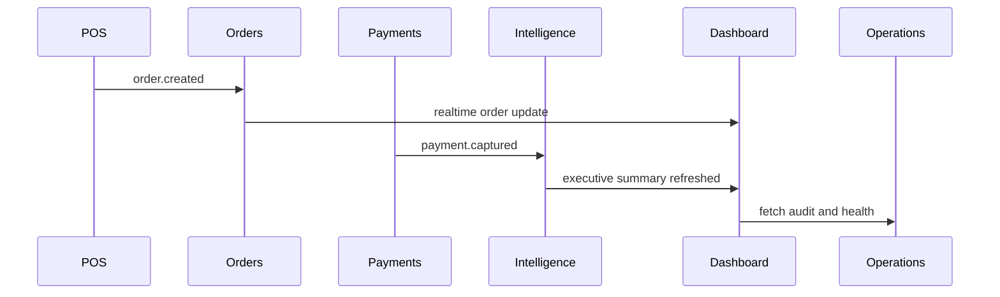

# SALORA Final Executive Report

## Scores

| Dimension | Score | Rationale |
|---|---:|---|
| DEV UI Maturity Score | 8.2/10 | Strong executive UX, many complete screens, mature visual language; data contracts are weaker. |
| Reuse Percentage | 65% | Layouts, widgets, charts, shells, AI studios, and simulator patterns are reusable; backend adapters and monolithic files require refactor. |
| Executive Dashboard Readiness | 85% | Command Deck can become Wave 1 quickly with API binding. |
| Revenue Dashboard Readiness | 70% | Great visual patterns; revenue data APIs/read models are missing. |
| Operations Dashboard Readiness | 75% | Order stream, automation, diagnostics, queue backend exist; needs realtime binding. |
| AI Dashboard Readiness | 80% | AI Brain, Content, Visual, and Tuner are mature; replace Gemini-specific routes. |
| Customer Dashboard Readiness | 65% | Mobile/loyalty/WhatsApp UX is compelling but mostly simulated. |
| Migration Complexity | Medium-high | Component extraction is manageable; data contract normalization is the main work. |
| Estimated Development Time Saved | 35-45% | DEV accelerates UX, dashboard layout, charts, mobile preview, and AI studio design. |

## Fastest Path

The fastest path to transform DEV dashboards into the SALORA Executive Command Center is:

1. Extract the shell and Command Deck into SALORA as Wave 1.
2. Create a thin SALORA API adapter layer for executive summary, revenue summary, live orders, and audit events.
3. Convert fixture-driven cards and charts into typed, API-backed widgets.
4. Add AI Studio as Wave 2 or Wave 4 depending on business urgency, replacing `/api/gemini/*` with `/api/ai/*`.
5. Decompose `HeadlessCms.tsx` and `EnterpriseArchitect.tsx` only after the executive dashboard is live, because they contain the richest ideas but the highest coupling.

## Architecture Artifacts

### Folder Structure

Recommended SALORA target structure:

```text
src/
  app/
    executive/
    revenue/
    operations/
    ai/
    customers/
    whatsapp/
    mobile-preview/
    monitoring/
    administration/
  components/
    dashboard/
      DashboardShell.tsx
      Sidebar.tsx
      TopBar.tsx
      KpiCard.tsx
      ChartPanel.tsx
      AuditLogFeed.tsx
      OperationsQueueWidget.tsx
    ai/
    mobile-preview/
    admin/
  lib/
    api/
      intelligence.ts
      payments.ts
      orders.ts
      customers.ts
      loyalty.ts
      ai.ts
      operations.ts
    design-system/
```

### Service Boundaries

| Boundary | Owns | Dashboard consumers |
|---|---|---|
| Intelligence | executive summaries, AI attribution, forecasts | Executive, AI |
| Payments | revenue, basket, refunds, payment status | Executive, Revenue |
| Orders | order lifecycle, order stream | Executive, Operations |
| Customers | profiles, reviews, segments, WhatsApp identities | Customer, WhatsApp |
| Loyalty | points, tiers, wallet pass, rewards | Customer, Executive |
| AI Gateway | chat, content, visual specs, prompt config | AI, Revenue, Customer |
| Operations | runtime, queues, audit, app config | Operations, Monitoring, Admin |

### API Contracts

Prioritize:

```http
GET /api/intelligence/executive-summary
GET /api/payments/revenue/summary
GET /api/payments/revenue/timeseries
GET /api/orders/summary
GET /api/orders/live
GET /api/operations/audit
GET /api/operations/health
POST /api/ai/chat
POST /api/ai/content/generate
POST /api/ai/visual/spec
```

### Event Flows



### Deployment Strategy

- Start with read-only dashboards.
- Gate command center under admin/executive roles.
- Keep feature flags per wave.
- Promote from internal staging to production after API freshness and error telemetry are stable.

### Observability Strategy

- Track dashboard API latency, dashboard load time, stale data age, realtime disconnects, and mutation audit success.
- Reuse Prometheus and Grafana queue foundation.
- Add Sentry context for dashboard screen, role, and request correlation ID.

## Final Recommendation

Start with `CommandDeck.tsx` plus the shell patterns from `App.tsx`. That gives SALORA a credible Executive Command Center fastest, while the team builds stable API contracts underneath. Treat `EnterpriseArchitect.tsx` and `HeadlessCms.tsx` as idea mines for later waves, not first-wave code.
