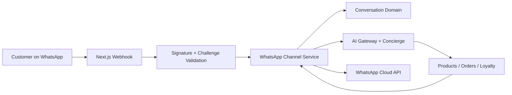

# WhatsApp Architecture

WhatsApp is a SALORA channel, not a bot. It does not own customer logic, order logic, loyalty logic, or AI logic. It adapts WhatsApp Cloud API traffic into SALORA's internal channel and conversation model.

## Folder Structure

```text
packages/backend/src/channels/
├── provider.ts
├── registry.ts
├── metrics.ts
└── whatsapp/
    ├── config.ts
    ├── security.ts
    ├── types.ts
    ├── parser.ts
    ├── provider.ts
    ├── service.ts
    └── webhook.ts
```

## Flow



## Disabled Default

Live Graph API calls are disabled unless `WHATSAPP_ENABLED=true` and the required credentials exist.
