# SALORA WhatsApp Enterprise Integration Audit

Date: 2026-06-04
Mode: SIMPLE_LAUNCH_MODE
Principle: CONTROL_TOWER_IS_THE_SINGLE_SOURCE_OF_TRUTH

## Executive Classification

| Area | Status | Evidence | Decision |
| --- | --- | --- | --- |
| Existing API structure | CONNECTED | Next.js App Router APIs exist under `apps/web/app/api`, including `/api/channels/whatsapp/webhook` and `/api/control-tower/whatsapp`. | Extend with canonical `/api/whatsapp/send` and `/api/whatsapp/webhook` adapters only. |
| Existing AI services | CONNECTED | `packages/backend/src/ai/concierge/service.ts`, AI gateway, provider registry, safety, evaluation, and recommendation engines exist. | Reuse AI Concierge; do not create a new WhatsApp bot brain. |
| Existing database schema | PARTIAL | Prisma has `Conversation`, `ConversationMessage`, `ProviderMessage`, `Notification`, `NotificationTemplate`, `NotificationDeliveryLog`, `ActivityLog`, `AuditLog`, and `RuntimeConfiguration`. | Reuse conversation/message models; add only a WhatsApp webhook event ledger because raw webhook event storage and dead-letter metadata are missing. |
| Existing logging services | CONNECTED | `ActivityLog` and `AuditLog` models exist; Control Tower helpers write both logs. Channel metrics and provider idempotency exist. | Use ActivityLog/AuditLog for mutations and provider/message tables for channel processing. |
| Existing Runtime Config | CONNECTED | `RuntimeConfiguration` supports `WHATSAPP`, `NOTIFICATIONS`, `PAYMENTS`, and `FEATURE_FLAGS`. Secret-like keys are blocked from Control Tower. | Keep credentials in environment variables only; use Control Tower for non-secret WhatsApp templates and runtime behavior. |
| Existing Control Tower modules | PARTIAL | Control Tower registry and WhatsApp section exist, but the page is mostly a modeled operations center and dashboard adapter reports unavailable aggregates. | Extend the existing section/module; do not create a separate dashboard. |
| Existing WhatsApp channel | PARTIAL | `packages/backend/src/channels/whatsapp` has provider, config, parser, security, service, webhook handler, idempotency, metrics, and webhook route. | Create requested enterprise integration layer as a typed facade over existing channel code. |
| Existing order integration | PARTIAL | `CafeOrder`, order timeline, notification templates/logs, COD runtime docs, and payment domain exist. | Add WhatsApp notification service hooks without enabling Stripe. |
| Instagram preparation | CONNECTED | Channel abstraction already has registry/provider concepts and docs for channel abstraction/Instagram. | Preserve abstraction; no Instagram implementation. |
| Observability | PARTIAL | Sentry config, OpenTelemetry, metrics, ActivityLog, AuditLog, and request IDs exist. | Add correlation IDs to WhatsApp routes and domain service calls. |

## Existing API Structure

CONNECTED:

- `apps/web/app/api/channels/whatsapp/webhook/route.ts` handles Meta verification and webhook POST through backend service functions.
- `apps/web/app/api/control-tower/whatsapp/route.ts` exposes Control Tower WhatsApp readiness and draft creation.
- Control Tower Simple Launch APIs exist for products, categories, promotions, coupons, runtime config, activity logs, and audit logs.
- AI APIs exist under `apps/web/app/api/ai/*`.

PARTIAL:

- There is no canonical `/api/whatsapp/send`.
- There is no canonical `/api/whatsapp/webhook`; current webhook lives under `/api/channels/whatsapp/webhook`.
- Route-level correlation IDs exist via `x-request-id`, but WhatsApp domain calls do not consistently pass them through.

## Existing AI Services

CONNECTED:

- AI Concierge exists in `packages/backend/src/ai/concierge/service.ts`.
- Product, order, loyalty, and menu context builders exist under `packages/backend/src/ai/concierge/context-builders`.
- Provider routing exists through `routeAiRequest` and provider registry.
- AI recommendation records exist for traceability.

PARTIAL:

- WhatsApp service invokes the concierge and recommendations, but the channel marker is currently `future_whatsapp` rather than a first-class WhatsApp AI channel.
- AI response persistence is through conversation messages and AI records, not a WhatsApp-specific table.

## Existing Database Schema

CONNECTED:

- `Conversation` supports `WHATSAPP`.
- `ConversationMessage` supports inbound/outbound messages, delivery status, provider message IDs, redacted text, metadata, and timestamps.
- `ProviderMessage` supports idempotency and processing status.
- `ActivityLog` and `AuditLog` support mutation traceability.
- `RuntimeConfiguration` supports `WHATSAPP`.

PARTIAL:

- Dedicated `WhatsappConversation` and `WhatsappMessage` models are not needed because equivalent channel-agnostic models exist.
- Dedicated `WhatsappWebhookEvent` is missing and required to store every webhook event and dead-letter failures without discarding failures.

## Existing Logging Services

CONNECTED:

- Control Tower write paths call `writeActivity` and `writeAudit`.
- Provider idempotency records processing lifecycle.
- Channel metrics record inbound, outbound, delivery, latency, and failures.

PARTIAL:

- Existing public webhook route catches failures and returns 500 but does not persist the full raw event lifecycle.

## Existing Runtime Configuration

CONNECTED:

- Runtime configuration model supports WhatsApp scope.
- Control Tower blocks secret-like runtime keys.

SECURITY DECISION:

- `WHATSAPP_PHONE_NUMBER_ID`, `WHATSAPP_WABA_ID`, `WHATSAPP_BUSINESS_ACCOUNT_ID`, `WHATSAPP_ACCESS_TOKEN`, and `WHATSAPP_VERIFY_TOKEN` must stay in `.env.local` or deployment secret storage.
- Control Tower may manage templates, pauses, escalation, retry knobs, and non-secret runtime controls only.

## Existing Control Tower Modules

CONNECTED:

- Control Tower registry includes WhatsApp and Instagram sections.
- `ControlTowerView` has WhatsApp workspace placement.
- `SupremacyCommandCenter` and Simple Launch operations modules exist.

PARTIAL:

- WhatsApp Command Center capabilities are documented/modelled but not yet backed by conversation search, status aggregates, pause/resume AI, and customer lookup APIs.

## Service Boundaries

| Boundary | Owner | Responsibility |
| --- | --- | --- |
| Next.js route adapters | `apps/web/app/api/whatsapp/*` | HTTP parsing, request ID/correlation ID creation, response formatting only. |
| WhatsApp integration layer | `packages/backend/src/integrations/whatsapp` | Meta client, validation, repository persistence, webhook orchestration, send orchestration. |
| Channel layer | `packages/backend/src/channels/whatsapp` | Existing provider implementation, parser, security, idempotency, metrics. |
| Conversation domain | `packages/backend/src/domains/conversations` | Conversation and message persistence. |
| AI Concierge | `packages/backend/src/ai/concierge` | Multilingual draft generation and context-aware assistance. |
| Control Tower | `apps/web/app/(control-tower)` and `apps/web/app/api/control-tower/*` | Operator controls and governance only. |

## API Contracts To Add

| Method | Path | Purpose |
| --- | --- | --- |
| `POST` | `/api/whatsapp/send` | Send text, template, or media-compatible WhatsApp messages using env credentials and structured logging. |
| `GET` | `/api/whatsapp/webhook` | Meta verification using env verify token. |
| `POST` | `/api/whatsapp/webhook` | Process inbound messages and statuses; store every webhook event and preserve failures. |

## Event Flow

```mermaid
flowchart LR
  Customer["Customer"] --> Meta["Meta WhatsApp Cloud API"]
  Meta --> Webhook["/api/whatsapp/webhook"]
  Webhook --> Ledger["WhatsappWebhookEvent"]
  Ledger --> Parser["WhatsApp Webhook Parser"]
  Parser --> Conversation["Conversation Service"]
  Conversation --> Concierge["AI Concierge"]
  Concierge --> Draft["Traceable AI Response"]
  Draft --> Sender["WhatsApp Send Service"]
  Sender --> Meta
  Sender --> Logs["ActivityLog + AuditLog + Metrics"]
```

## Deployment Strategy

- Store secrets in `.env.local` for local runtime and deployment secret manager for hosted environments.
- Apply additive Prisma migration for webhook event ledger.
- Run validation sequence: `prisma validate`, `prisma generate`, lint, typecheck, test, build.
- Keep `/api/channels/whatsapp/webhook` as backward-compatible alias and expose `/api/whatsapp/webhook` as canonical Meta URL.

## Observability Strategy

- Every route generates or forwards `correlationId`/`x-request-id`.
- Every send mutation writes ActivityLog and AuditLog when Prisma is available.
- Webhook events are persisted before processing and marked `PROCESSED` or `FAILED`.
- Failed webhook events remain queryable as dead-letter records.
- Sentry/OpenTelemetry continues through existing backend tracing and Next.js Sentry configuration.

## Implementation Decision

Proceed with an additive enterprise layer. Do not duplicate existing conversation, AI, channel, Control Tower, ActivityLog, AuditLog, or RuntimeConfiguration systems.
